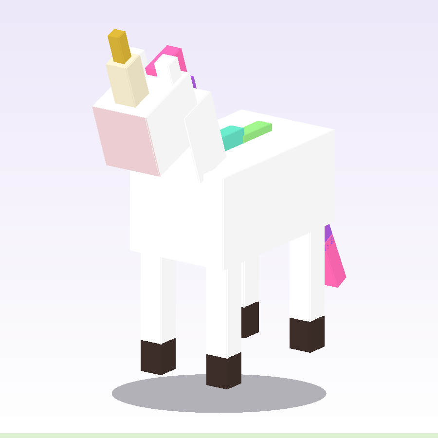

# Ride a Unicorn

A Minecraft Bedrock Edition addon that adds a rideable unicorn: a custom entity with hand-built
geometry, texture, and animations, tameable-free riding (walk up and interact to mount), and a
rare natural spawn.



*Rendered directly from the model data in `tools/unicorn_model.py` by `tools/render_preview.py` --
not a hand-picked screenshot, so it can never show a different model than what actually ships.*

## Structure

```
UnicornAddon_BP/       Behavior pack -- entity definition, spawn rules
UnicornAddon_RP/       Resource pack -- geometry, texture, animations, render controller
UnicornAddon_TestBP/   Dev-only behavior pack -- automated in-game self-test (see below)
assets/
  preview.png          README screenshot, rendered by tools/render_preview.py
tools/
  unicorn_model.py      Shared source of truth: the unicorn's bones/cubes/colors + geometry math
  generate_addon.py     Generates every BP/RP file from unicorn_model.py
  render_preview.py     Renders assets/preview.png from the same unicorn_model.py data
  png_writer.py          Minimal PNG encoder shared by the two generators above
  sync-to-minecraft.ps1     Copies the packs into Minecraft's dev pack folders
  activate-in-world.ps1     Activates the packs inside an existing world save
UnicornAddon.mcaddon    Packaged build (not committed -- see Packaging below)
```

`UnicornAddon_BP` and `UnicornAddon_RP` are generated output. `tools/unicorn_model.py` is the
actual source: it defines the unicorn's bones/cubes once, and both `tools/generate_addon.py` (the
`.geo.json` + hand-painted texture + every UV coordinate) and `tools/render_preview.py` (the README
screenshot above) derive from that single source, so the model, the addon, and its preview image
can never drift out of sync with each other. To change the model or texture palette, edit
`tools/unicorn_model.py` and regenerate both -- don't hand-edit the JSON/PNG under
`UnicornAddon_BP`/`UnicornAddon_RP` directly.

## Requirements

- Minecraft Bedrock Edition 1.21.80+
- Python 3 (only for regenerating the addon; not needed to just play it)

## Building

```bash
python tools/generate_addon.py
```

Regenerates `UnicornAddon_BP` and `UnicornAddon_RP` in place. The script asserts model geometry
sanity at build time (feet touch the ground, no detached mane pieces, UV rects stay in bounds) and
will fail loudly rather than emit a broken model.

```bash
python tools/render_preview.py
```

Regenerates `assets/preview.png`. Run this too after any model change so the README screenshot
stays in sync.

## Packaging

```powershell
Compress-Archive -Path UnicornAddon_BP, UnicornAddon_RP -DestinationPath UnicornAddon.mcaddon.zip
Rename-Item UnicornAddon.mcaddon.zip UnicornAddon.mcaddon
```

Double-clicking the resulting `.mcaddon` imports both packs into Minecraft.

## Development / testing

`tools/sync-to-minecraft.ps1` copies `UnicornAddon_BP`, `UnicornAddon_RP`, and the dev-only
`UnicornAddon_TestBP` into Minecraft's `development_behavior_packs` / `development_resource_packs`
folders (both the Microsoft Store install and a standalone-launcher install, if present). Re-run
it after every change, then fully exit and re-enter the world.

`tools/activate-in-world.ps1` switches the packs on inside a world save's
`world_behavior_packs.json` / `world_resource_packs.json` (existing entries are merged, not
overwritten) so you don't have to click through the in-game pack menus by hand.

`UnicornAddon_TestBP` is a separate dev-only behavior pack (never packaged into the `.mcaddon`)
that runs an automated self-test on world join:

- Spawns a unicorn on verified clear ground near the player
- Reads back its components via the Script API and asserts health, movement speed, collision box,
  and every `minecraft:rideable` field (seat position, seat count, interact text, allowed rider
  families) against expected values
- Holds the unicorn in place for 10 seconds after spawning (a script-side position lock, not an
  addon feature) so you have time to walk over and look at it before AI wandering kicks in
- Reports PASS/FAIL per check in chat

Re-run on demand with `/scriptevent unicorn:test`. Opt in to an automated mount check (seats the
player via `EntityRideableComponent.addRider`) with `/scriptevent unicorn:ride`.

## Riding

Walk up to a unicorn and interact with it (right-click / equivalent) to mount immediately -- no
taming or saddle required. Sneak to dismount.
